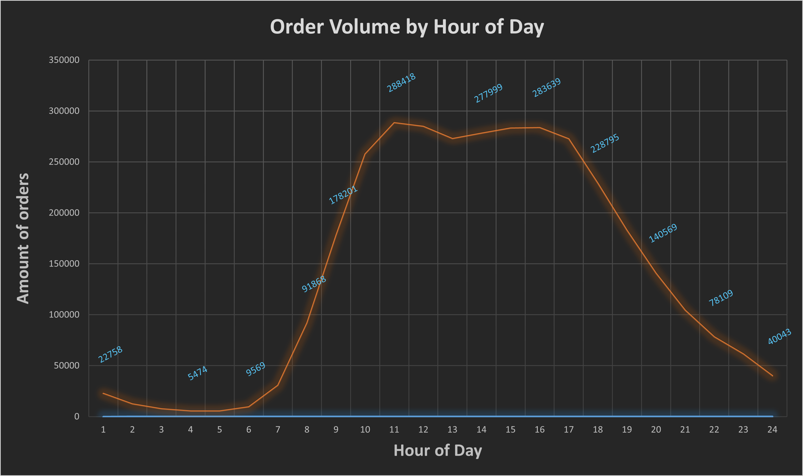
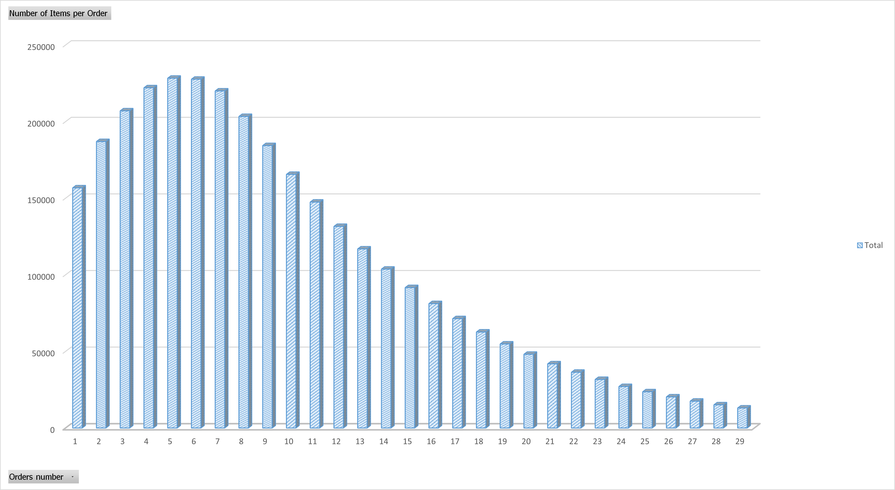
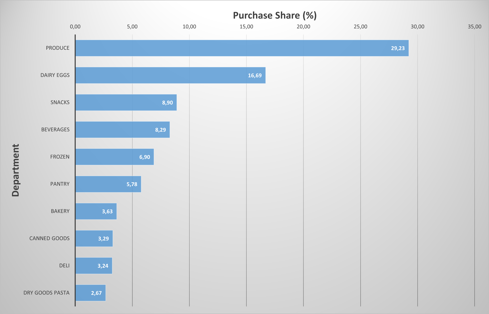
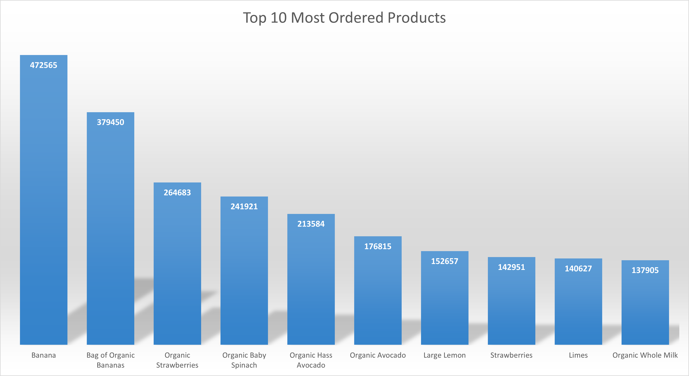

# Instacart Market Basket Analysis

Exploratory data analysis of the Instacart online grocery shopping dataset using **PostgreSQL** and **Excel visualizations** to understand customer purchasing behavior, product popularity, and ordering patterns.

---

# Project Overview

Instacart is an online grocery delivery service that allows customers to order products from various supermarkets.  
This project analyzes customer orders to uncover patterns in purchasing behavior and identify key operational insights.

The analysis focuses on:

- Customer ordering behavior
- Popular products and departments
- Basket size distribution
- Hourly ordering patterns
- Product relationships and purchasing trends

The goal is to simulate a **real-world data analyst workflow** using SQL and data visualization.

---

# Dataset

Dataset used:  
**Instacart Online Grocery Shopping Dataset**

The dataset contains:

- **3+ million grocery orders**
- **200k+ users**
- **49k+ products**
- Product hierarchy including **departments and aisles**

Main tables used:

| Table | Description |
|-----|-----|
| orders | Customer orders |
| order_products_prior | Products purchased in previous orders |
| products | Product catalog |
| departments | Product departments |
| aisles | Product aisles |

---

# Tools Used

- PostgreSQL
- SQL
- Excel
- GitHub

---

# Key Business Questions

The analysis answers the following questions:

1. **When do customers place the most orders?**
2. **Which products are most frequently purchased?**
3. **Which departments generate the most sales?**
4. **What is the typical basket size?**
5. **What product combinations appear frequently together?**

---

# Order Volume by Hour

Understanding hourly order patterns helps businesses plan staffing, logistics, and warehouse operations.

**Insight**

- Orders start increasing after **7 AM**
- Peak ordering hours occur between **10 AM and 4 PM**
- Order volume declines steadily after **6 PM**

This pattern reflects typical daily shopping behavior.

---

# Basket Size Distribution

This visualization shows how many items customers typically purchase per order.

**Insight**

- Most baskets contain **5–10 items**
- Median basket size is around **8 items**
- Large orders are less frequent but still present

Understanding basket size helps estimate **average order value and fulfillment workload**.

---

# Department Purchase Share

This chart shows the share of purchases by product department.

**Insight**

- **Produce dominates purchases (~29%)**
- Dairy and snacks follow
- Fresh food categories significantly outperform packaged goods

This reflects strong demand for fresh groceries in online shopping.

---

# Most Popular Products

The following chart shows the most frequently purchased products.

**Insight**

- Bananas are the most purchased product
- Organic fruits and vegetables dominate the top positions
- Fresh produce items are heavily represented in the top 10

This indicates high demand for **healthy and fresh grocery items**.

---

# SQL Analysis

All SQL scripts used in the analysis are available in the `sql` folder.

Each script corresponds to a stage of the analytical workflow.

---

# Key Insights

From the analysis we discovered:

- Customer orders peak during **late morning and afternoon hours**
- **Fresh produce dominates online grocery purchases**
- The most popular products are mostly **organic fruits and vegetables**
- Typical baskets contain **5–10 items**
- Ordering behavior follows a **daily routine pattern**

These insights can help grocery retailers optimize:

- inventory management
- warehouse staffing
- product placement
- promotion strategies

---

# Author

Stanislav Patlakha  
Junior Data Analyst Portfolio Project
